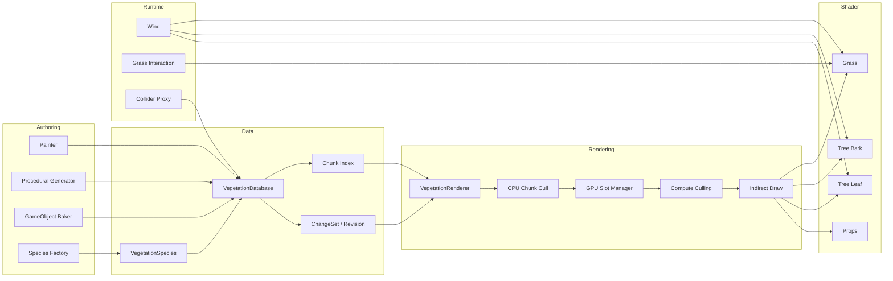

# Architecture

## 1. Design Goal

系统的目标不是单纯提高植被 Draw Call 性能，而是让大规模植被仍然具备可编辑性、稳定身份、程序生成能力、运行时交互以及可验证的性能收益。

因此整体架构按职责拆分为：

```text
Authoring Layer
Data Layer
Rendering Layer
Runtime Support Layer
Validation Layer
```

## 2. Layered Architecture



## 3. Why the Renderer Does Not Own Authoring Data

如果 Renderer 自己保存实例，那么：

- Painter 必须直接修改 Renderer。
- Procedural Generator 必须直接修改 Renderer。
- GameObject Importer 也必须理解 Renderer 的 GPU 数据格式。
- 更换渲染策略会影响所有编辑器工具。

因此实例数据被放在独立 Database 中。

Renderer 只消费 Database 的状态与 ChangeSet。

这使：

```text
Instance Source
```

与：

```text
Rendering Strategy
```

解耦。

## 4. Stable Identity

系统区分：

```text
persistentID
speciesID
speciesIndex
GPU slot
```

它们不是同一概念。

`persistentID` 是单个实例的长期身份；`speciesID` 是物种稳定身份；`speciesIndex` 是当前数组中的运行时位置；`GPU slot` 是渲染器内部资源位置。

避免使用 List Index 作为长期身份，是整个增量更新方案能够稳定工作的前提。

## 5. Runtime Data Flow

```text
Database Change
↓
ChangeSet
↓
Renderer receives delta
↓
Resolve instance identity
↓
Update local GPU slot
↓
Camera selects visible chunks
↓
Compute filters instances
↓
LOD classification
↓
Indirect draw
↓
Shader deformation / lighting
```

## 6. Supporting Systems

### Wind

风是 Shader 顶点变形的一部分，不要求每个实例拥有 GameObject。

### Grass Interaction

Interactor 数据作为小规模全局数组上传 GPU，避免 CPU 对所有草做接触查询。

### Collider Proxy

碰撞与渲染解耦。只有靠近玩家的特定 Species 才创建 Proxy。

### Diagnostics

Benchmark 与 Diagnostics 不进入生产渲染主链，但用于验证优化收益和发现回归问题。
