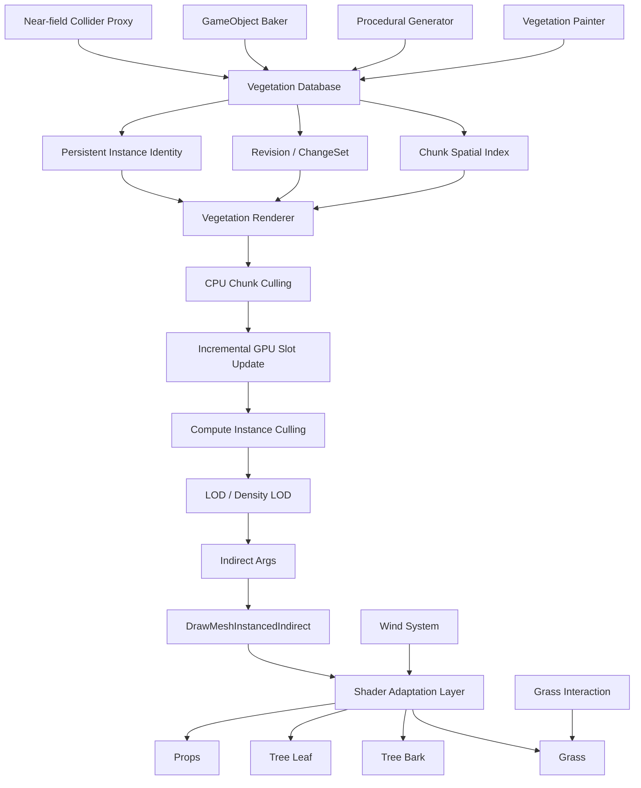

# Unity GPU Vegetation System

> A data-driven vegetation authoring and rendering system for Unity URP, designed for large-scale scenes, stable editing workflows, runtime interaction, and GPU-driven rendering.

这是一套面向 Unity URP 的数据驱动植被系统。它不只负责“把大量草和树画出来”，还覆盖了植被生产、实例数据库、Chunk 空间管理、增量 GPU 数据同步、Compute Culling、LOD、Indirect Rendering、Shader 适配、近场碰撞、草地交互、性能 Benchmark 与诊断工具。

## Highlights

- **Unified Vegetation Database**：手工刷取、程序化生成、已有 GameObject 导入共用同一套实例数据库。
- **Stable Persistent Identity**：使用 `persistentID / speciesID` 将实例长期身份与当前数组索引解耦。
- **Chunk-based Spatial Management**：按 Chunk 管理实例，用于编辑查询、CPU 粗裁剪与局部更新。
- **Incremental GPU Updates**：基于 `ChangeSet + persistentID -> GPU slot` 只更新发生变化的 GPU 数据，而不是每次重传全部实例。
- **GPU Compute Culling**：CPU 先做 Chunk 粗裁剪，GPU 再进行实例级视锥、距离、LOD 与密度筛选。
- **Indirect Rendering**：最终通过 `DrawMeshInstancedIndirect` 提交大规模植被。
- **Shader Adaptation Layer**：将实际项目中的 Grass / Tree / Props Shader 接入自定义实例矩阵、LOD、风、Shadow、Depth 与 DepthNormals。
- **GPU Grass Interaction**：少量 Interactor 数据上传 GPU，在顶点阶段完成草地推开、压弯与恢复。
- **Near-field Collider Proxies**：仅在玩家附近为树木/岩石等实例激活物理碰撞代理。
- **Authoring Toolchain**：支持 Painter、Procedural Generator、GameObject Baker、Species Factory、材质适配与 Collider 自动估算。
- **Benchmark & Diagnostics**：提供不同优化组合、实例规模与渲染特性的性能测试与自动诊断。

---

## System Overview



系统可以概括为：

```text
Authoring
    ↓
Vegetation Database
    ↓
Chunk / ChangeSet / Persistent ID
    ↓
Vegetation Renderer
    ↓
CPU Chunk Culling
    ↓
Incremental GPU Slot Update
    ↓
Compute Instance Culling
    ↓
LOD / Density LOD
    ↓
Indirect Draw
    ↓
Shader Adaptation Layer
```

外围系统包括：

```text
Wind
Grass Interaction
Near-field Collision
Terrain Color Integration
Additional Lights
Benchmark
Automated Diagnostics
```

---

## Why This Architecture?

大规模植被系统的难点并不只是 Draw Call。

如果只解决“渲染很多实例”，仍然会遇到：

- 编辑器里如何稳定地刷、删、移动实例？
- 程序生成与手工实例如何共存？
- 已经摆好的 GameObject 如何迁移进 GPU 系统？
- 删除一个实例时是否需要重建整个 GPU Buffer？
- 玩家附近的树如何继续参与物理碰撞？
- 草如何响应角色移动，而不为每根草创建 Collider？
- Camera、Shadow、DepthNormals 与 LOD 如何保持一致？
- 优化到底有没有效果，如何验证？

因此系统被拆成了三个相对独立的层：

1. **Authoring Layer**：负责“实例从哪里来”。
2. **Data Layer**：负责“实例是谁、在哪里、如何被查询和修改”。
3. **Rendering Layer**：负责“实例如何进入 GPU、如何被筛选并绘制”。

这样 Painter、Procedural Generator 和 Imported GameObject 不需要各自维护一套 Renderer。

---

## Core Architecture

### 1. Vegetation Database

Database 是系统的统一数据源，而不是 Renderer 的临时输入。

每个实例拥有稳定身份与来源信息，例如：

```text
persistentID
speciesID
speciesIndex
sourceType
generationOwnerID
generationBatchID
transform
```

其中：

- `persistentID`：实例长期身份。
- `speciesID`：Species 的稳定身份。
- `speciesIndex`：当前运行时索引，可变。
- `sourceType`：区分 Manual / Procedural / Imported。
- `generationOwnerID / generationBatchID`：用于程序生成结果的归属与批次管理。

Database 还维护：

- Chunk Spatial Index
- Persistent ID Lookup
- Species ID Lookup
- Revision
- ChangeSet
- Batch Modification
- Local Species Rebuild
- Full Rebuild Fallback

详细说明见 [Docs/DataPipeline.md](Docs/DataPipeline.md)。

---

### 2. Incremental GPU Instance Update

系统不会因为新增、删除或移动少量实例就重传整个 Instance Buffer。

Renderer 为 `Species × Chunk` 分配 GPU Slot，并维护：

```text
persistentID -> GPU slot
freeSlots
activeCount
capacity
chunkRange
```

删除实例时释放 Slot；新增实例优先复用空闲 Slot；实例跨 Chunk 移动时从旧 Chunk 释放，再向新 Chunk 申请。

连续 Slot 更新会尽量合并为更少的 Buffer Upload。

```text
Database ChangeSet
        ↓
Resolve persistentID
        ↓
Find / Allocate / Release GPU Slot
        ↓
Merge contiguous updates
        ↓
Partial SetData
```

这使动态编辑成本更接近“实际变化量”，而不是“场景总实例数”。

详细说明见 [Docs/DataPipeline.md](Docs/DataPipeline.md)。

---

### 3. CPU + GPU Two-stage Culling

第一阶段由 CPU 对 Chunk 做粗粒度裁剪：

```text
Camera
↓
Chunk Bounds
↓
Visible Chunk Ranges
```

第二阶段只对候选范围 Dispatch Compute Shader：

```text
Visible Chunk Range
↓
Instance Frustum / Distance Culling
↓
Mesh LOD
↓
Density LOD
↓
Visible Index Buffers
↓
Indirect Args
```

这样既避免 CPU 对全部实例逐个判断，也减少 GPU 对明显不可见 Chunk 的无效工作。

详细说明见 [Docs/RenderingPipeline.md](Docs/RenderingPipeline.md)。

---

## LOD Strategy

系统包含两种不同层级的 LOD：

### Mesh LOD

用于树木、灌木、Props 等：

```text
LOD0
LOD1
LOD2
LOD3
Cull
```

LOD 过渡区域可让实例同时进入相邻两个 LOD，并通过 Shader Dither 完成 Cross Fade。

### Density LOD

主要用于草。

远距离不只切 Mesh，还逐渐减少实例密度。筛选使用稳定 Hash，因此同一个实例在相同条件下保持稳定结果，避免逐帧随机导致的闪烁。

---

## Shader Adaptation Layer

最终使用的 Shader 并不是单独的一套“测试植被 Shader”，而是将项目实际资产 Shader 适配到 GPU Vegetation Pipeline。

目前包含：

- Grass
- Tree Bark
- Tree Leaf
- Props / Rock

适配内容包括：

```text
SV_InstanceID
↓
Visible Instance Index
↓
Custom ObjectToWorld
↓
Wind
↓
Grass Interaction
↓
LOD Dither
↓
Lighting
```

同时保持：

- Forward
- ShadowCaster
- DepthOnly
- DepthNormals

之间的顶点变形一致性。

详细说明见 [Docs/ShaderIntegration.md](Docs/ShaderIntegration.md)。

---

## GPU Grass Interaction

草地交互不通过为大量 Grass Instance 创建 Collider 实现。

运行时只上传少量 Interactor：

```text
VegetationGrassInteractor
↓
Position / Radius / Strength / Velocity / Motion
↓
VegetationInteractionController
↓
Priority + Camera Distance Selection
↓
Shader Global Arrays
↓
Grass Vertex Deformation
```

Shader 将径向推开方向与角色运动方向混合，并使用草根到草尖的 Mask 控制弯曲程度。

交互同步应用到 Forward、Shadow、Depth 与 DepthNormals Pass。

详细说明见 [Docs/InteractionAndCollision.md](Docs/InteractionAndCollision.md)。

---

## Near-field Collision

树木和岩石等真正需要物理碰撞的实例采用近场 Proxy。

```text
Player Position
↓
Nearby Chunks
↓
Collision-enabled Species
↓
Activation Radius
↓
Collider Proxy Pool
```

远离玩家后 Proxy 返回对象池。

这样可以保留 GPU Rendering，同时避免为全部远景植被长期维护 GameObject + Collider。

---

## Authoring Workflow

系统支持三种主要实例来源：

```text
Manual Painting
Procedural Generation
Existing GameObject Import
        ↓
Vegetation Database
        ↓
Same Runtime Renderer
```

### Manual Painter

用于 Scene View 中的：

- Paint
- Erase
- Select
- Move
- Local editing

### Procedural Generator

候选点会经过完整规则链：

```text
Distribution
↓
Biome Mask
↓
Ground Projection
↓
Height
↓
Slope
↓
Terrain Layer Rules
↓
Parent Species Influence
↓
Exclusion / Density Volume
↓
Weighted Species Selection
↓
Minimum Spacing
↓
Placement
```

### GameObject Baker

用于把已经摆好的场景对象迁移到实例数据库，同时保留已有美术布局。

详细说明见 [Docs/Authoring.md](Docs/Authoring.md)。

---

## Performance Validation

项目包含专门的 Benchmark 与 Diagnostics，而不是只依赖肉眼判断。

可测试不同组合，例如：

```text
Baseline
+ CPU Chunk Cull
+ GPU Instance Cull
+ Mesh / Density LOD
Fully Optimized
```

以及不同实例规模：

```text
100k
500k
1M
```

采集内容包括：

- CPU Frame Time
- GPU Frame Time
- Memory
- GC
- Visible Range Count
- Compute Dispatch Count
- Draw Count
- LOD Counters
- Shadow Candidate Count

详细说明见 [Docs/Performance.md](Docs/Performance.md)。

---

## Documentation

- [Architecture](Docs/Architecture.md)
- [Data Pipeline](Docs/DataPipeline.md)
- [Rendering Pipeline](Docs/RenderingPipeline.md)
- [Authoring Workflow](Docs/Authoring.md)
- [Shader Integration](Docs/ShaderIntegration.md)
- [Interaction & Collision](Docs/InteractionAndCollision.md)
- [Performance & Diagnostics](Docs/Performance.md)
- [Known Limitations](Docs/KnownLimitations.md)

---

## Project Positioning

这个项目的重点不是重新实现 Unity 的 Renderer，而是围绕真实环境场景中的植被生产与运行时需求，建立一套能够同时支持：

```text
Artist Editing
Procedural Placement
Stable Data Management
Large-scale GPU Rendering
Runtime Interaction
Runtime Collision
Performance Validation
```

的完整工作流。

对于 Technical Artist 工作而言，重点在于连接：

> **Art Asset → Authoring Tool → Runtime Data → GPU Rendering → Debug / Profiling**

而不是只实现某一个独立 Shader 或单个渲染 API。
